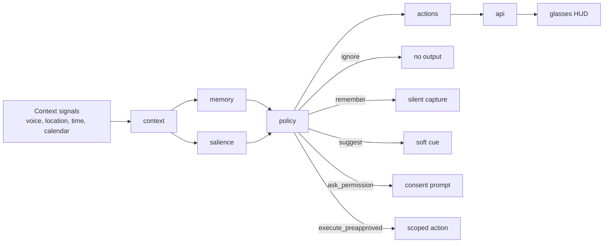

# AIR

**AIR is the layer that decides when an always-on agent should stay silent, remember, interrupt, or act.**

Built for the Even G2 hackathon. Wearable AI feels useful only when it's *polite by construction* — and the part of an agent that knows when not to speak is exactly the part the model layer doesn't solve.

> Tagline: *"An orchestrator for agents that know when to stay silent, when to remember, and when to act."*

---

## The three demo flows

| Flow | What it shows | Spec |
|---|---|---|
| **1. Leaving Mode** | Routine support — calendar + travel-time signals produce one earned `suggest` cue, nothing else. | `docs/product-spec.md` |
| **2. Memory Capture** | A casual voice mention is captured silently and resurfaces only when context warrants. | `docs/flow-memory-capture.md` |
| **3. Consentful Action** | Running-late detection produces an `ask_permission` cue; one tap sends; user can graduate to a scoped, revocable preapproval. | `docs/flow-consentful-action.md` |

The 2-minute judge-facing walkthrough is in [`docs/demo-script.md`](docs/demo-script.md).

---

## Why this is not a model wrapper

Most agent demos compete on the LLM tier. AIR's value is *upstream of the model*:

- **Context schema** — what an event is, what a memory carries.
- **Salience scoring** — six dimensions, weighted formula, explicit thresholds.
- **Policy pipeline** — six gates that downgrade toward silence, with privacy and memory governance overrides.
- **Cooldown / interruption budget** — the trust-critical feature most ambient demos skip.
- **Permissioned action layer** — graduated consent, scoped preapprovals, allowlisted templates.
- **Cue copy contract** — every HUD string ≤ 40 chars, no exclamation marks, no chat aesthetic.

Each lives as its own spec under [`docs/`](docs/). The repo is built so the docs are the contract and `src/` follows.

---

## Architecture



Core modules under [`src/`](src/) (after PR #3 lands on main): `context/`, `memory/`, `salience/`, `policy/`, `actions/`, `api/`, `demo/`. See [`AGENTS.md`](AGENTS.md) for tooling and conventions, [`HANDOFF.md`](HANDOFF.md) for live coordination state.

---

## Quick start

```bash
npm install
npm run build
npm start
```

Server defaults to `http://localhost:3000`.

```bash
npm test
```

## API surface

The baseline scaffold exposes three endpoints. Schema lives in [`docs/context-schema.md`](docs/context-schema.md).

```bash
# Ingest one ambient event
curl -X POST http://localhost:3000/events \
  -H 'content-type: application/json' \
  -d '{
    "kind": "departure_signal",
    "source": "calendar",
    "payload": { "minutes_to_departure": 6, "destination": "office" },
    "confidence": 0.92,
    "privacy_risk": 0.2,
    "timestamp": "2026-04-26T15:24:00.000Z"
  }'

# Inspect the orchestrator's state
curl http://localhost:3000/state

# Run the Leaving Mode demo flow
curl -X POST http://localhost:3000/demo/leaving-mode
```

`POST /demo/memory-capture` and `POST /demo/consentful-action` land with **AIR-022** and **AIR-023**.

---

## Spec docs

| Doc | Topic |
|---|---|
| [`docs/product-spec.md`](docs/product-spec.md) | Product thesis, target user, decisions, success criteria |
| [`docs/context-schema.md`](docs/context-schema.md) | Typed shapes for every entity (events, memory, decisions, permissions) |
| [`docs/policy-rules.md`](docs/policy-rules.md) | Salience formula, threshold table, cooldown rules, walk-throughs |
| [`docs/glasses-cue-copy.md`](docs/glasses-cue-copy.md) | Every HUD string + voice/tone contract |
| [`docs/privacy-model.md`](docs/privacy-model.md) | Data categories, retention, audit log, opt-in/revoke UX |
| [`docs/hackathon-tracks.md`](docs/hackathon-tracks.md) | How AIR maps to each track, with the moment to watch for |
| [`docs/flow-memory-capture.md`](docs/flow-memory-capture.md) | Flow 2 spec |
| [`docs/flow-consentful-action.md`](docs/flow-consentful-action.md) | Flow 3 spec |
| [`docs/demo-script.md`](docs/demo-script.md) | The 2-minute walkthrough |

Tasks are tracked in Priority Forge under project `AIR`. Live coordination state for both maintainers (Nick on Claude, Sebastian on Codex) lives in [`HANDOFF.md`](HANDOFF.md).
