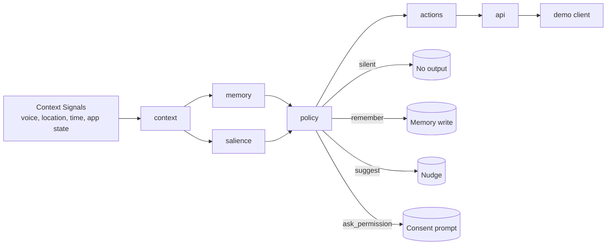

# SenseRoute

**SenseRoute is a lightweight decision layer for always-on agents that determines when to stay silent, remember, suggest, or ask for permission.**

## The problem (why this exists)
Always-on agents are useful only if they are behaviorally safe and socially aware.

In practice, an ambient system has to decide in real time whether to:
- do nothing (stay silent),
- store something for later (remember),
- proactively help (suggest), or
- request user consent before taking action (ask permission).

Most prototypes over-index on model output quality and under-invest in these routing decisions.

## What SenseRoute does
SenseRoute is a **policy-and-salience router** for ambient interactions. It is designed to:
- ingest context signals,
- score whether an event is salient,
- apply memory and policy constraints,
- choose one action (`silent | remember | suggest | ask_permission`),
- expose that decision through an API for a wearable or companion app.

> Current status: this repository is a hackathon scaffold focused on architecture and interface shape.

## Why this is different from a chatbot or OpenRouter-style model routing
- **Not a chatbot:** chatbots mainly generate responses after explicit prompts. SenseRoute decides whether a response should happen at all.
- **Not just model routing:** model routers choose *which LLM/provider* to call. SenseRoute chooses *whether to act* and *how to act safely* based on context, salience, memory, and policy.
- **Ambient-first:** built for continuous, low-friction interaction loops rather than single request/response sessions.

## Architecture (hackathon view)


## Core modules
- **context**: normalizes current signals (time, user state, device state, environment).
- **memory**: stores and retrieves short/long-term facts and recent events.
- **salience**: estimates how important/urgent an event is.
- **policy**: applies boundaries and selects allowed behavior.
- **actions**: executes the selected behavior (`silent`, `remember`, `suggest`, `ask_permission`).
- **api**: HTTP interface for decision requests and memory operations.
- **demo**: simple script/app to simulate ambient events and inspect router output.

## Install and run
```bash
npm install
npm run build
npm start
```

If `npm start` is not defined yet in your local branch, run the API entrypoint directly once implemented.

## Run tests
```bash
npm test
```

## Demo endpoint examples (target contract for hackathon demo)
> These examples describe the intended demo API shape and should be aligned with implementation as endpoints land.

```bash
# 1) Route an ambient event
curl -X POST http://localhost:3000/api/route \
  -H "Content-Type: application/json" \
  -d '{
    "userId": "u_123",
    "event": "calendar_conflict_detected",
    "context": {
      "inMeeting": true,
      "device": "earbuds",
      "time": "2026-04-26T14:00:00Z"
    }
  }'

# 2) Write a memory candidate
curl -X POST http://localhost:3000/api/memory \
  -H "Content-Type: application/json" \
  -d '{
    "userId": "u_123",
    "fact": "Prefers text summaries after meetings",
    "source": "interaction"
  }'

# 3) Health check
curl http://localhost:3000/health
```

## Next 24-hour roadmap (hackathon)
1. Implement minimal API endpoints: `/health`, `/api/route`, `/api/memory`.
2. Add deterministic `salience` and `policy` v0 rules with clear unit tests.
3. Add an in-memory `memory` adapter, then optional SQLite via Prisma.
4. Build a tiny `demo` script that replays 5 realistic ambient scenarios.
5. Add observability logs: input context, selected action, policy reason.
6. Tighten safety: explicit permission gates and deny-by-default action policy.
7. Ship a 2-minute walkthrough (GIF or terminal script) for judges.
